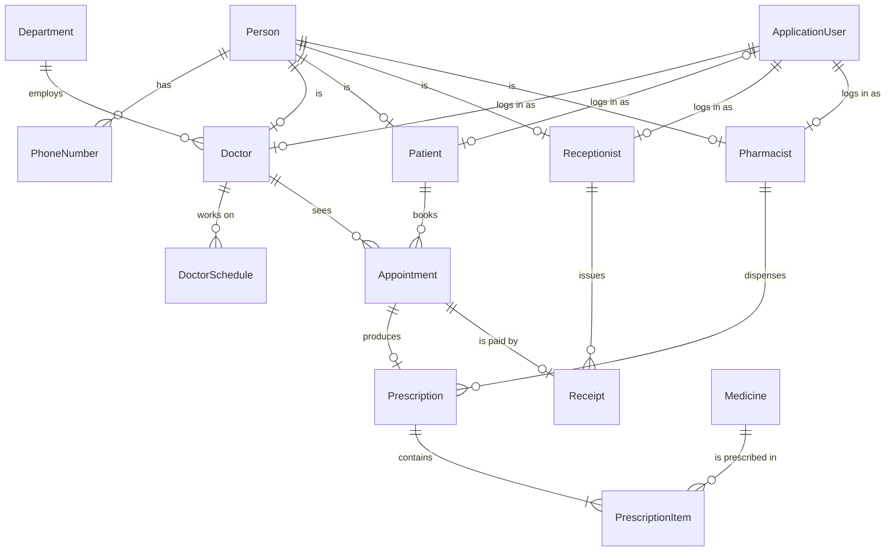

# Hurghada Hospital Management System (HHMS)

A web application covering the patient journey: registration, appointment booking, diagnosis and medical history, prescriptions, pharmacy dispensing, and billing. It acts as a secure electronic medical record (EMR) for hospital staff, and it gives patients a portal to manage their own appointments and view their records.

## Objectives

- Keep complete and secure electronic medical records for every patient.
- Coordinate appointments between patients, doctors and departments.
- Manage prescriptions and link them to pharmacy inventory.
- Protect sensitive medical data through role-based access control, and handle concurrent updates to the same patient record safely.

## Team

**Team Leader:** Seif Ahmed — 01119470160

| Member | Role | GitHub |
|---|---|---|
| Seif Ahmed | Backend | [@SeifAhmed17](https://github.com/SeifAhmed17) |
| Moamen Mahmoud | Backend | [@moamenAboelazm](https://github.com/moamenAboelazm) |
| Mohammed Ali | Backend | [@Borha123321](https://github.com/Borha123321) |
| Mohammed Mahmoud | Backend | [@Mohammed-Mahmoud787](https://github.com/Mohammed-Mahmoud787) |
| Marwan Saber | Backend (automation) | [@marwansaber3345](https://github.com/marwansaber3345) |
| Patrick Hany | Frontend / Design | [@patrick856](https://github.com/patrick856) |
| Mohammed Hany | Frontend / Design | [@Engmohamed89hany](https://github.com/Engmohamed89hany) |
| Omar Essam | Testing / QA | Not on GitHub |
| Ahmed Gamal | Testing / QA | Not on GitHub |

## Features

The system has five user roles. Each role only sees what it needs.

| Role | What they can do |
|---|---|
| **Patient** | Sign up online and manage their profile · Book and cancel their own appointments · View their own medical history (read-only) · View their own prescriptions · View their own receipts |
| **Doctor** | See their own appointment schedule · Read and write the medical history of **their own patients only** · Write prescriptions |
| **Receptionist** | Register walk-in patients · Book and cancel appointments on a patient's behalf · Check patients in · Record appointment payments and issue receipts · Search patients (contact details only, no medical data) |
| **Pharmacist** | See prescriptions waiting to be filled · Dispense medication (stock updates automatically) · Manage medicine stock · Receive low-stock alerts |
| **Admin** | Full access to the system · Manage staff accounts and departments · Set doctors' working hours |

**Modules:** Patient registration & medical history · Doctor & department management · Appointment scheduling & cancellation · Prescriptions & medication records · Pharmacy inventory · Billing (appointment fees)

**Automations (n8n):** Appointment reminders · Booking and cancellation confirmations · Low-stock alerts to the pharmacist

**Future work (out of the current scope):** Hospital admission

## Tech Stack

| Layer | Technology |
|---|---|
| Backend | ASP.NET Core (C#) |
| Authentication | ASP.NET Core Identity + JWT tokens |
| Database | SQL Server, hosted online on MonsterASP.NET so the whole team shares one database |
| Frontend | Next.js (React) |
| Automation | n8n |

**Why this stack**

- **We already know C#**, so the backend team can start building right away.
- **Security is built in.** ASP.NET Core has built-in authentication and role-based authorization, which suits a system holding sensitive medical records. Users log in with **JWT tokens**, which our separate Next.js frontend sends with every API request.
- **Modern and in demand.** These tools are widely used in industry.

## Project Structure

Everything lives in this one repository.

```
hhms/
├── backend/      ASP.NET Core Web API
├── frontend/     Next.js app
├── n8n/          exported n8n workflows (.json)
├── docs/         diagrams, database schema, reports
└── README.md
```

**Backend:** one ASP.NET Core Web API project, organized by type of file. The API returns JSON only (no server-rendered views). Database rules are written with EF Core's Fluent API in `Data/Configurations/`, one class per entity, so the model classes stay clean.

```
backend/HHMS.Api/
├── Controllers/  one API controller per module (Patients, Appointments, ...)
├── Services/     business logic for each module
├── Data/         everything about data
│   ├── AppDbContext.cs   database context
│   ├── Models/           database entities (Patient, Doctor, Appointment, ...)
│   ├── DTOs/             request and response objects
│   ├── Configurations/   database rules for each entity (keys, lengths, relationships)
│   └── Migrations/       database schema history
├── Middleware/   request pipeline steps (e.g. global error handling, logging)
├── Filters/      checks that run around controller actions (e.g. validation)
└── Program.cs
```

## Database Design

Our SQL Server database has 14 main tables, plus the standard ASP.NET Core Identity tables for logins and roles. Every table has a `Guid` `Id` primary key, and columns ending in `Id` are foreign keys. In code, entity classes use a `Cls` prefix (e.g. `ClsPatient`) and enums an `En` prefix (e.g. `EnGender`).

| Group | Table | Columns |
|---|---|---|
| People | **Person** | Id, FirstName, LastName, NationalId, PassportNumber, Gender, DateOfBirth, Country, Governorate |
| | **PhoneNumber** | Id, Number, PersonId |
| | **ApplicationUser** | Id, Email, PasswordHash, UserType *(ASP.NET Core Identity)* |
| Roles | **Doctor** | Id, UserId, PersonId, DepartmentId, AppointmentDurationMinutes, Salary |
| | **Patient** | Id, UserId, PersonId, Allergies, ChronicDiseases, BloodType, PastSurgeries, FamilyHistory, RowVersion |
| | **Receptionist** | Id, PersonId, UserId, Salary |
| | **Pharmacist** | Id, PersonId, UserId, Salary |
| Hospital setup | **Department** | Id, Name, ConsultationFee |
| | **DoctorSchedule** | Id, DoctorId, DayOfWeek, StartTime, EndTime |
| Visits | **Appointment** | Id, DoctorId, PatientId, AppointmentDateTime, Status, Complaint, Diagnosis, Notes, RowVersion |
| | **Prescription** | Id, AppointmentId, AdditionalNotes, Status, DispensedAt, PharmacistId, RowVersion |
| | **PrescriptionItem** | Id, PrescriptionId, MedicineId, Dosage, Quantity |
| Pharmacy | **Medicine** | Id, Name, Price, ExpiryDate, Quantity, LowStockThreshold, RowVersion |
| Billing | **Receipt** | Id, AppointmentId, PaymentMethod, Amount, PaidAt, ReceptionistId |



Every table and column is explained in detail in [docs/database-models.md](docs/database-models.md).

**Key design decisions**

- **One `Person` table** holds personal details for everyone, and each role (doctor, patient, receptionist, pharmacist) links to it. `NationalId` or `PassportNumber` identifies a person, since many of our patients in Hurghada are tourists.
- **Walk-in patients** have no login, so `Patient.UserId` is optional.
- **Medical history** has two parts: the patient's background (allergies, chronic diseases, blood type, past surgeries, family history) on `Patient`, and each visit's complaint, diagnosis and notes on its `Appointment`.
- **Doctor schedules** are stored as one row per working day, so each doctor can have different hours on different days.
- **Concurrent updates:** `Patient`, `Appointment`, `Prescription` and `Medicine` have a `RowVersion` column. If two users edit the same record at the same time, the second save is rejected instead of silently overwriting the first.
- **Billing:** each department has a consultation fee. The amount is copied into the `Receipt` at payment time, so old receipts stay correct if the fee changes.
- **Pharmacy stock:** dispensing a prescription lowers `Medicine.Quantity` by each item's quantity. When stock falls below `LowStockThreshold`, the pharmacist is alerted.

## How We Work

- **Agile:** one-week sprints on our public [Trello board](https://trello.com/b/mb3fqB6Y), with sprint planning, stand-ups, a sprint review and a retrospective each week. See the [Agile Plan](#agile-plan).
- **Backend:** we assign backend tasks as the project progresses.
- **Frontend:** one designer builds the staff screens and the other builds the patient portal.
- **Automation:** Marwan Saber builds the n8n workflows.
- **Testing:** Omar Essam and Ahmed Gamal test each feature as it's finished, report bugs, and track our progress.
- Credit for every finished task is recorded in the [Contributions](#contributions) table below.

## Timeline

A weekly plan from project start to final delivery on **December 25, 2026**, when everything must be working. New features stop on **December 11**; the last two weeks are reserved for testing, bug fixes and demo preparation.

| Week | Dates | Backend | Frontend | Testing |
|---|---|---|---|---|
| 1 | Sep 28 – Oct 4 | Data models, database schema, configuration | Color palette, fonts, app identity | Set up progress tracking (Trello board ✅) |
| 2 | Oct 5 – 11 | Accounts, login, roles | Login and sign-up screens | Test login and roles |
| 3 | Oct 12 – 18 | Admin: staff, departments, doctors' hours | Admin screens | Test the previous week's features |
| 4 | Oct 19 – 25 | Patients: sign-up, profile, walk-ins, search | Patient profile and reception screens | Test the previous week's features |
| 5 | Oct 26 – Nov 1 | Appointments: booking and cancellation | Booking screens | Test the previous week's features |
| 6 | Nov 2 – 8 | Doctor schedule, check-in | Doctor schedule screen | Test the previous week's features |
| 7 | Nov 9 – 15 | Medical history | Medical history screens | Test the previous week's features |
| 8 | Nov 16 – 22 | Prescriptions | Prescription screens | Test the previous week's features |
| 9 | Nov 23 – 29 | Pharmacy: queue, dispensing, stock | Pharmacy screens | Test the previous week's features |
| 10 | Nov 30 – Dec 6 | n8n automations, billing, catch-up | Billing screens, polish, responsive layout | Test the previous week's features |
| 11 | Dec 7 – 11 | Catch-up, integration | Catch-up, integration | Full end-to-end test |
| 12–13 | Dec 12 – 25 | **No new features:** testing, bug fixes, demo and presentation rehearsal | | |

## Agile Plan

Every planned task lives on our public Trello board.

| | |
|---|---|
| **Board** | [HHMS](https://trello.com/b/mb3fqB6Y) |
| **Workspace** | [HHMS](https://trello.com/w/hhms1) |
| **Visibility** | Public: anyone with the link can view it |
| **Sprint length** | 1 week (Monday – Sunday) |
| **Sprints** | 13, from Sep 28 to Dec 25, 2026 (feature freeze Dec 11) |
| **Cards** | 69 planned tasks |

### Board Setup

#### Lists

| List | Meaning |
|---|---|
| **Backlog** | Every planned task that isn't in the current sprint |
| **Sprint** | Tasks picked for this week |
| **In Progress** | Someone is working on it right now |
| **Testing** | Finished by the developer, waiting for the testers (Omar Essam, Ahmed Gamal) |
| **Done** | Tested and working |

A card only moves to **Done** after it passes testing. If a test fails, the card goes back to **In Progress** and a red `Bug` card is added.

#### Card Format

Every card title starts with its sprint and module, e.g. **S4 · Patients — Walk-in patient registration**.

- **Due date:** the last day of the card's sprint.
- **Members:** the person working on the card is assigned to it.

#### Labels

We use labels to show which team a card belongs to.

| Color | Label | Why this color |
|---|---|---|
| 🟩 Green | `Backend` | Like green terminal text: the "engine room" |
| 🟦 Blue | `Frontend` | The most common UI color: what users see |
| 🟨 Yellow | `Testing` | Caution: "check this" |
| 🟪 Purple | `n8n` | Automation stands apart from normal coding |
| ⬛ Black | `Team` | Neutral: belongs to everyone |
| 🟥 Red | `Bug` | Error: a problem found during testing |

### How a Card Moves

1. **Sprint planning:** the card moves from **Backlog** to **Sprint** and gets assigned.
2. **Work starts:** the assigned member moves it to **In Progress**.
3. **Work finishes:** it moves to **Testing**.
4. **Testing:** the testers try it. If it passes, it moves to **Done**. If it fails, it goes back to **In Progress** and a `Bug` card is added.
5. **Sprint review:** every card in **Done** is added to the [Contributions](#contributions) table.

### Weekly Routine

| When | Meeting | What happens |
|---|---|---|
| Start of the week | **Sprint planning** | We move this week's cards from Backlog to Sprint and assign each one |
| During the week | **Stand-ups** | Short check-ins: what I did, what I'll do next, anything blocking me |
| End of the week | **Sprint review** | We show what is done and add finished tasks to the Contributions table |
| End of the week | **Retrospective** | What went well, what didn't, and what we change next week |

### Backlog by Sprint

These are the cards on our board, grouped by sprint. They follow our [timeline](#timeline). Click a sprint to open it.

<details>
<summary><b>Sprint 1 · Sep 28 – Oct 4</b> (7 cards)</summary>

| Card | Label |
|---|---|
| S1 · Setup — Design the data models | 🟩 Backend |
| S1 · Setup — Design the database schema | 🟩 Backend |
| S1 · Setup — Set up the project and its configuration | 🟩 Backend |
| S1 · Setup — Choose the color palette | 🟦 Frontend |
| S1 · Setup — Choose the fonts | 🟦 Frontend |
| S1 · Setup — Create the app identity (name, logo, look and feel) | 🟦 Frontend |
| S1 · Setup — Set up the Trello board and progress tracking | 🟨 Testing |

</details>

<details>
<summary><b>Sprint 2 · Oct 5 – 11</b> (5 cards)</summary>

| Card | Label |
|---|---|
| S2 · Auth — Account registration and login | 🟩 Backend |
| S2 · Auth — User roles and permissions | 🟩 Backend |
| S2 · Auth — Login screen | 🟦 Frontend |
| S2 · Auth — Sign-up screen | 🟦 Frontend |
| S2 · Auth — Test login, sign-up and role permissions | 🟨 Testing |

</details>

<details>
<summary><b>Sprint 3 · Oct 12 – 18</b> (5 cards)</summary>

| Card | Label |
|---|---|
| S3 · Admin — Manage staff accounts | 🟩 Backend |
| S3 · Admin — Manage departments | 🟩 Backend |
| S3 · Admin — Set doctors' working hours | 🟩 Backend |
| S3 · Admin — Admin screens (staff, departments, working hours) | 🟦 Frontend |
| S3 · Admin — Test the admin features | 🟨 Testing |

</details>

<details>
<summary><b>Sprint 4 · Oct 19 – 25</b> (6 cards)</summary>

| Card | Label |
|---|---|
| S4 · Patients — Patient sign-up and profile | 🟩 Backend |
| S4 · Patients — Walk-in patient registration | 🟩 Backend |
| S4 · Patients — Patient search (contact details only) | 🟩 Backend |
| S4 · Patients — Patient profile screen | 🟦 Frontend |
| S4 · Patients — Reception screens (registration, search) | 🟦 Frontend |
| S4 · Patients — Test the patient features | 🟨 Testing |

</details>

<details>
<summary><b>Sprint 5 · Oct 26 – Nov 1</b> (5 cards)</summary>

| Card | Label |
|---|---|
| S5 · Appointments — Book an appointment | 🟩 Backend |
| S5 · Appointments — Cancel an appointment | 🟩 Backend |
| S5 · Appointments — Booking screen for patients | 🟦 Frontend |
| S5 · Appointments — Booking screen for receptionists | 🟦 Frontend |
| S5 · Appointments — Test booking and cancellation | 🟨 Testing |

</details>

<details>
<summary><b>Sprint 6 · Nov 2 – 8</b> (5 cards)</summary>

| Card | Label |
|---|---|
| S6 · Appointments — Doctor's appointment schedule | 🟩 Backend |
| S6 · Appointments — Patient check-in | 🟩 Backend |
| S6 · Appointments — Doctor schedule screen | 🟦 Frontend |
| S6 · Appointments — Check-in screen | 🟦 Frontend |
| S6 · Appointments — Test the schedule and check-in | 🟨 Testing |

</details>

<details>
<summary><b>Sprint 7 · Nov 9 – 15</b> (6 cards)</summary>

| Card | Label |
|---|---|
| S7 · Medical History — Doctors add diagnoses and visit notes | 🟩 Backend |
| S7 · Medical History — Doctors see only their own patients' history | 🟩 Backend |
| S7 · Medical History — Patients view their own history | 🟩 Backend |
| S7 · Medical History — Medical history screen for doctors | 🟦 Frontend |
| S7 · Medical History — Medical history screen for patients | 🟦 Frontend |
| S7 · Medical History — Test medical history and access rules | 🟨 Testing |

</details>

<details>
<summary><b>Sprint 8 · Nov 16 – 22</b> (5 cards)</summary>

| Card | Label |
|---|---|
| S8 · Prescriptions — Doctors write prescriptions | 🟩 Backend |
| S8 · Prescriptions — Patients view their own prescriptions | 🟩 Backend |
| S8 · Prescriptions — Prescription screen for doctors | 🟦 Frontend |
| S8 · Prescriptions — Prescriptions screen for patients | 🟦 Frontend |
| S8 · Prescriptions — Test prescriptions | 🟨 Testing |

</details>

<details>
<summary><b>Sprint 9 · Nov 23 – 29</b> (5 cards)</summary>

| Card | Label |
|---|---|
| S9 · Pharmacy — Prescriptions waiting to be filled | 🟩 Backend |
| S9 · Pharmacy — Dispense medication and update stock | 🟩 Backend |
| S9 · Pharmacy — Manage medicine stock | 🟩 Backend |
| S9 · Pharmacy — Pharmacy screens (queue, dispensing, stock) | 🟦 Frontend |
| S9 · Pharmacy — Test the pharmacy features | 🟨 Testing |

</details>

<details>
<summary><b>Sprint 10 · Nov 30 – Dec 6</b> (9 cards)</summary>

| Card | Label |
|---|---|
| S10 · Automation — Appointment reminders | 🟪 n8n |
| S10 · Automation — Booking and cancellation confirmations | 🟪 n8n |
| S10 · Automation — Low-stock alerts to the pharmacist | 🟪 n8n |
| S10 · Polish — Polish the screens and make them responsive | 🟦 Frontend |
| S10 · Catch-up — Finish unfinished backend cards | 🟩 Backend |
| S10 · Automation — Test the automations | 🟨 Testing |
| S10 · Billing — Record appointment payments and receipts | 🟩 Backend |
| S10 · Billing — Payment screen for receptionists and receipts screen for patients | 🟦 Frontend |
| S10 · Billing — Test billing | 🟨 Testing |

</details>

<details>
<summary><b>Sprint 11 · Dec 7 – 11</b> (3 cards)</summary>

| Card | Label |
|---|---|
| S11 · Integration — Frontend and backend working together end to end | 🟩 Backend · 🟦 Frontend |
| S11 · Catch-up — Finish unfinished cards | 🟩 Backend · 🟦 Frontend |
| S11 · Integration — Full end-to-end test of every role | 🟨 Testing |

</details>

<details>
<summary><b>Sprint 12 · Dec 12 – 18 (no new features)</b> (4 cards)</summary>

| Card | Label |
|---|---|
| S12 · Bugs — Fix the reported bugs (no new features) | 🟩 Backend · 🟦 Frontend · 🟥 Bug |
| S12 · Bugs — Retest the fixed bugs | 🟨 Testing · 🟥 Bug |
| S12 · Demo — Prepare the demo script | 🟨 Testing |
| S12 · Demo — Prepare the presentation | ⬛ Team |

</details>

<details>
<summary><b>Sprint 13 · Dec 19 – 25 (no new features)</b> (4 cards)</summary>

| Card | Label |
|---|---|
| S13 · Bugs — Final bug fixes (no new features) | 🟩 Backend · 🟦 Frontend · 🟥 Bug |
| S13 · Testing — Final full test | 🟨 Testing |
| S13 · Demo — Demo rehearsal | ⬛ Team |
| S13 · Docs — Final README and documentation update | ⬛ Team |

</details>

## Contributions

| Task | Done by | Date |
|---|---|---|
| Project planning (scope, roles, features, timeline, tech stack) | Whole team | Sep 28, 2026 |
| Agile plan and Trello board setup | Whole team | Sep 30, 2026 |
| Project structure | Whole team | Oct 2, 2026 |
| Model skeletons, enums, Identity user and `AppDbContext` | Moamen Mahmoud | Oct 3–4, 2026 |
| Doctor and DoctorSchedule models and configurations | Moamen Mahmoud | Oct 4, 2026 |
| Person, PhoneNumber, Patient, Receptionist and Pharmacist models and configurations | Marwan Saber | Oct 3–5, 2026 |
| Medicine model; Receipt and PrescriptionItem models and configurations | Mohammed Ali | Oct 3–4, 2026 |
| Appointment, Prescription and Department models and configurations; Medicine configuration | Seif Ahmed | Oct 3–5, 2026 |
| Initial database migration (20 tables on SQL Server) | Seif Ahmed | Oct 5, 2026 |
| Code reviews and merging (pull requests #1–#6) | Seif Ahmed, Moamen Mahmoud | Oct 3–5, 2026 |
